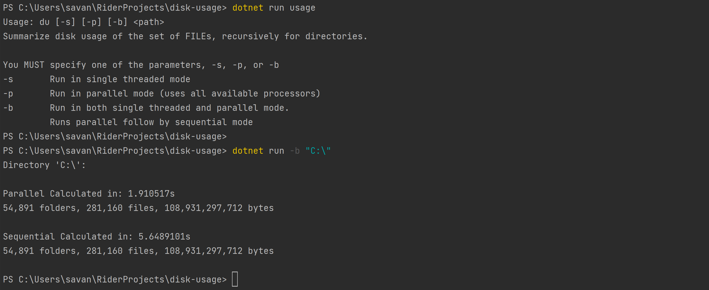

# Disk Usage


## Description
A program that runs in a targeted directory to determine the total number of folders, files, and the size of the data. This program works similarly
to the disk usage tool on Linux/Unix operating systems, but it was developed sequentially and in parallel using the C# parallel libraries to compare
run times for given directories.

## Getting Started

### Dependencies
* .NET 6.0

### Installing
```
# Clone this repository
$ git clone https://github.com/sea7321/disk-usage.git

# Go into the repository
$ cd disk-usage
```

### Executing program

```
# Run the program
$ dotnet run [-s] [-p] [-b] <path>
```
You MUST specify one of the parameters, -s, -p, or -b
* s - run in single threaded mode
* p - run in parallel mode (uses all available processors)
* b - run in both single threaded and parallel mode. Runs parallel follow by sequential mode


## Author
Savannah Alfaro, sea2985@rit.edu